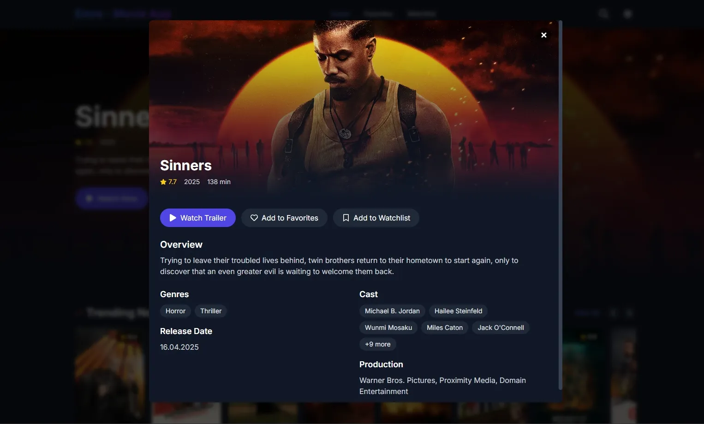

# Emre - Movie App

A modern movie discovery platform that provides information about the latest movies using the TMDB API. This application offers a sleek, responsive interface with dark/light mode support and various interactive features. All buttons and features are fully functional, including movie trailers, favorites, watchlist, search, and theme switching.

[Live Demo](https://kochemre.github.io/my-movie-app/)

---

## 📸 Screenshots



---

## Features

- **Modern Interface**: Sleek and responsive design built with Tailwind CSS
- **Dark/Light Mode**: Automatic or manual theme switching based on user preference
- **Movie Categories**: Trending, Popular, Top Rated, and Upcoming movies
- **Search Functionality**: Search for movies by title
- **Favorites**: Save and manage your favorite movies
- **Watchlist**: Keep track of movies you want to watch
- **Scrollable Lists**: Movie lists organized by categories
- **Hero Slider**: Full-screen slider showcasing featured movies
- **Movie Trailers**: Watch movie trailers directly in the app
- **Movie Details**: View detailed information about movies
- **Responsive Design**: Optimized for both mobile and desktop devices

---

## Technologies

- **React**: For building the user interface and managing component state
- **Vite**: For fast development and optimized production builds
- **Tailwind CSS**: For styling and responsive design with utility classes
- **React Router**: For page routing and navigation
- **Framer Motion**: For smooth animations and transitions
- **React Icons**: For comprehensive icon library
- **TMDB API**: For fetching movie data and metadata
- **Context API**: For global state management (favorites, watchlist, theme)
- **Local Storage**: For persisting user preferences and saved movies

---

## Installation

1. **Clone the Repository**:
   Clone the project from GitHub:

   ```bash
   git clone https://github.com/KochEmre/my-movie-app.git
   ```

2. **Navigate to the Project Directory**:
   ```bash
   cd my-movie-app
   ```

3. **Install Dependencies**:
   ```bash
   npm install
   ```

4. **Set Up Environment Variables**:
   Create a `.env` file in the root directory and add your TMDB API key:
   ```
   VITE_IMDB_API_KEY=your_api_key_here
   ```

5. **Start the Development Server**:
   ```bash
   npm run dev
   ```

## Usage

The application offers an intuitive interface for discovering and managing movies:

- **Home Page**: Features a hero slider with featured movies and sections for trending, popular, top-rated, and upcoming movies
- **Movie Interaction**:
  - Hover over movie cards to reveal options for adding to favorites or watchlist
  - Click on a movie card to view more details
  - Use the "Watch Now" button to view movie trailers
  - Use the "More Info" button to see detailed information about the movie
- **Navigation**:
  - **Favorites**: Access your saved favorite movies
  - **Watchlist**: View movies you've added to watch later
  - **Search**: Click the search icon to find specific movies by title
  - **Theme**: Toggle between light and dark mode using the sun/moon icon
- **Responsive Design**: The interface adapts to different screen sizes, providing an optimal experience on both mobile and desktop devices

## Configuration

The application uses The Movie Database (TMDB) API to fetch movie data. You'll need to:

1. Create an account on [TMDB](https://www.themoviedb.org/)
2. Generate an API key from your account settings
3. Create a `.env` file in the root directory of the project and add your API key:

```
VITE_IMDB_API_KEY=your_api_key_here
```

## Deployment

To deploy the application to GitHub Pages:

```bash
npm run deploy
```

This will build the application and deploy it to the `gh-pages` branch of your repository.

## Project Structure

```
src/
├── assets/         # Static assets like images
├── components/     # Reusable UI components
├── contexts/       # React context providers
├── pages/          # Page components
├── services/       # API and other services
├── styles/         # Global styles
├── utils/          # Utility functions
├── App.jsx         # Main application component
└── main.jsx        # Application entry point
```

## Contributing

1. Fork this repository
2. Create a new feature branch (`git checkout -b feature/amazing-feature`)
3. Commit your changes (`git commit -m 'Add some amazing feature'`)
4. Push to the branch (`git push origin feature/amazing-feature`)
5. Open a Pull Request

## License

This project is licensed under the MIT License. See the `LICENSE` file for more information.

## Contact

Emre - [@yourtwitterhandle](https://twitter.com/yourtwitterhandle) - email@example.com

Project Link: [https://github.com/KochEmre/my-movie-app](https://github.com/KochEmre/my-movie-app)

## Acknowledgements

- [TMDB](https://www.themoviedb.org/) - For providing the movie data API
- [Tailwind CSS](https://tailwindcss.com/) - For the utility-first CSS framework
- [React](https://reactjs.org/) - For the component-based UI library
- [Vite](https://vitejs.dev/) - For the fast development and build tool
- [Framer Motion](https://www.framer.com/motion/) - For the animation library
- [React Router](https://reactrouter.com/) - For the routing library
- [React Icons](https://react-icons.github.io/react-icons/) - For the icon library
