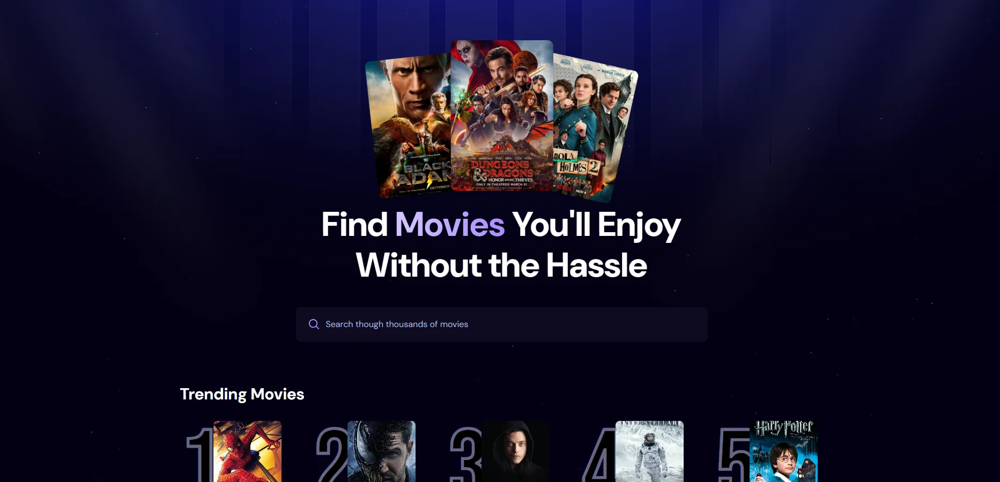

# Emre - Movie App

A modern movie discovery platform that provides information about the latest movies using the TMDB API.

[Live Demo](https://kochemre.github.io/my-movie-app/)

---

## 📸 Screenshots



---

## Features

- **Modern Interface**: Sleek and responsive design built with Tailwind CSS
- **Dark/Light Mode**: Automatic or manual theme switching based on user preference
- **Movie Categories**: Trending, Popular, Top Rated, and Upcoming movies
- **Search Functionality**: Search for movies by title
- **Favorites**: Save and manage your favorite movies
- **Watchlist**: Keep track of movies you want to watch
- **Scrollable Lists**: Movie lists organized by categories
- **Hero Slider**: Full-screen slider showcasing featured movies

---

## Technologies

- **React**: For the user interface
- **Vite**: For fast development and building
- **Tailwind CSS**: For styling and responsive design
- **React Router**: For page routing
- **Framer Motion**: For animations
- **React Icons**: For UI icons
- **TMDB API**: For movie data

---

## Installation

1. **Clone the Repository**:
   Clone the project from GitHub:

   ```bash
   git clone https://github.com/KochEmre/my-movie-app.git
   ```

2. **Navigate to the Project Directory**:
   ```bash
   cd my-movie-app
   ```

3. **Install Dependencies**:
   ```bash
   npm install
   ```

4. **Start the Development Server**:
   ```bash
   npm run dev
   ```

## Usage

The application displays movies in different categories on the home page. When you hover over movies, options to add them to your favorites or watchlist are displayed.

- **Home Page**: Shows trending, popular, top-rated, and upcoming movies
- **Favorites**: Displays and manages movies you've added to your favorites
- **Watchlist**: Tracks movies you want to watch
- **Search**: Click on the search icon in the top menu to search for movies
- **Theme Switching**: Click on the sun/moon icon in the top menu to change the theme

## Configuration

You need an API key to use the TMDB API. Create an account on [TMDB](https://www.themoviedb.org/) and get an API key.

Create a `.env` file in the root directory of the project and add your API key:

```
VITE_IMDB_API_KEY=your_api_key_here
```

## Contributing

1. Fork this repository
2. Create a new feature branch (`git checkout -b feature/amazing-feature`)
3. Commit your changes (`git commit -m 'Add some amazing feature'`)
4. Push to the branch (`git push origin feature/amazing-feature`)
5. Open a Pull Request

## License

This project is licensed under the MIT License. See the `LICENSE` file for more information.

## Contact

Emre - [@yourtwitterhandle](https://twitter.com/yourtwitterhandle) - email@example.com

Project Link: [https://github.com/KochEmre/my-movie-app](https://github.com/KochEmre/my-movie-app)

## Acknowledgements

- [TMDB](https://www.themoviedb.org/) - For movie data
- [Tailwind CSS](https://tailwindcss.com/) - For the awesome CSS framework
- [React](https://reactjs.org/) - For the user interface library
- [Vite](https://vitejs.dev/) - For the fast development experience
